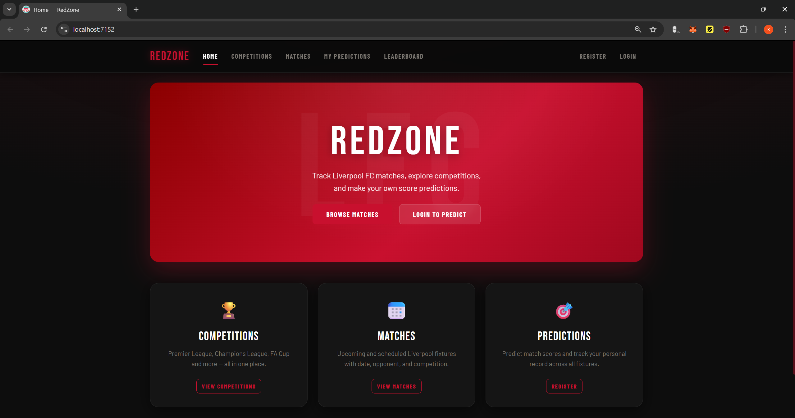
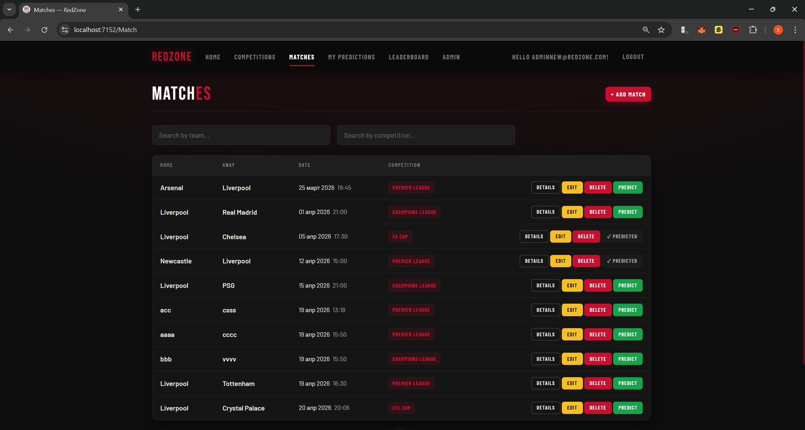
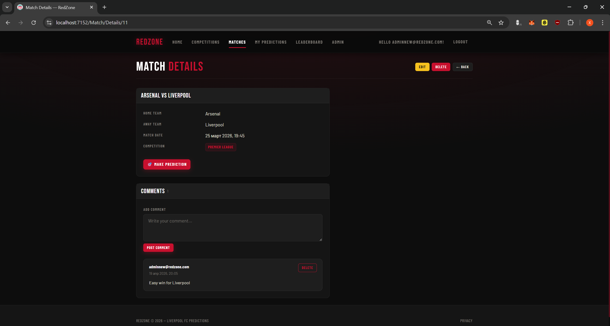
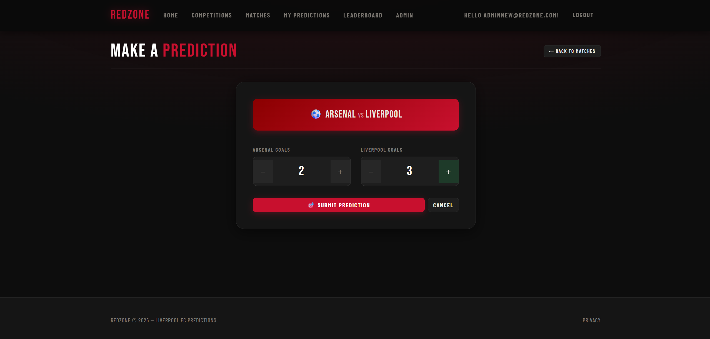
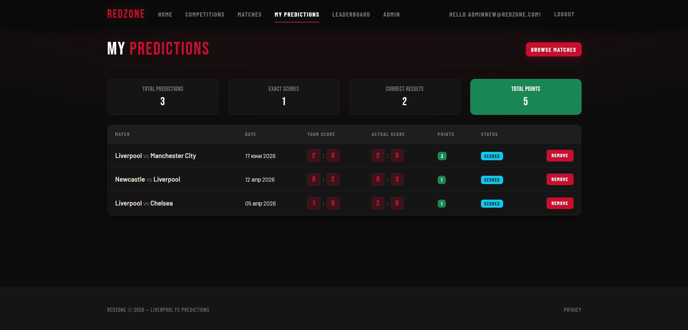
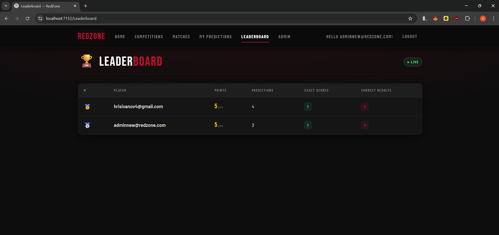
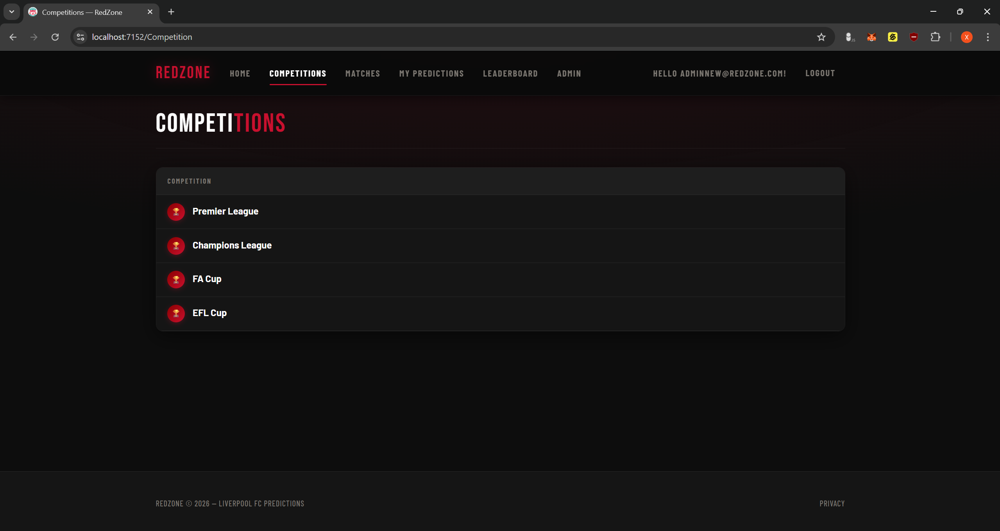
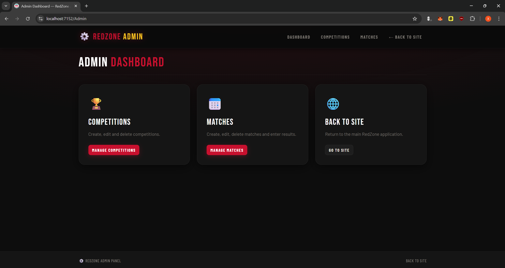
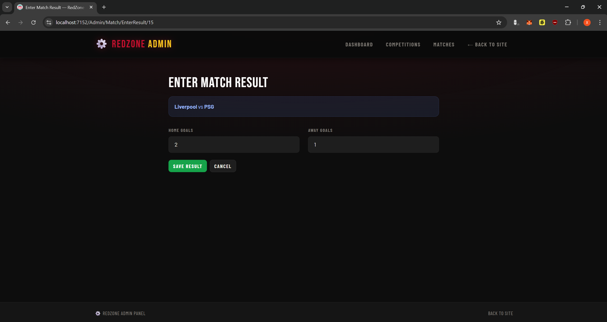

# ⚽ RedZone — Liverpool FC Match Predictor

RedZone is an ASP.NET Core MVC web application for tracking Liverpool FC matches, browsing football competitions, making score predictions, and competing with other users on a live leaderboard.

---

## 📸 Screenshots


| Page | Preview |
|------|---------|
| Home |  |
| Matches |  |
| Match Details & Comments |  |
| Make Prediction |  |
| My Predictions |  |
| Leaderboard |  |
| Competitions |  |
| Admin Dashboard |  |
| Admin — Enter Result |  |

---

## 🎬 Demo Video

📽️ **[Watch Demo Video](https://youtu.be/x4flOyzlZhg)**


## ✨ Features

- Browse Liverpool FC upcoming matches sorted by date with pagination and live search
- Full competition management (Premier League, Champions League, FA Cup, EFL Cup)
- Authenticated users can submit score predictions for upcoming matches
- Duplicate prediction prevention — one prediction per match per user
- Cannot predict finished matches
- Users can remove their own predictions
- Full personal prediction history with points breakdown
- Personal stats card — total predictions, exact scores, correct results, total points
- Role-based access control — Admin / User / Guest with different permissions
- Admin area for managing matches, competitions and entering results
- Automatic points calculation when admin enters a match result
  - Exact score → 3 points
  - Correct result (win/draw/loss) → 1 point
  - Wrong → 0 points
- Live leaderboard with SignalR — updates instantly for all users when a result is entered
- Comments on match details — post and delete without page reload (AJAX)
- Toast notifications for all key actions
- Custom 404 and error pages
- Dark Liverpool-themed responsive UI

---

## 🔐 Roles & Permissions

| Action | Guest | User | Admin |
|--------|-------|------|-------|
| View matches list | ✅ | ✅ | ✅ |
| View leaderboard | ✅ | ✅ | ✅ |
| View competitions | ✅ | ✅ | ✅ |
| View match details & comments | ❌ | ✅ | ✅ |
| Post / delete own comments | ❌ | ✅ | ✅ |
| Make a prediction | ❌ | ✅ | ✅ |
| View own predictions | ❌ | ✅ | ✅ |
| Delete own prediction | ❌ | ✅ | ✅ |
| Delete any comment | ❌ | ❌ | ✅ |
| Create/Edit/Delete matches | ❌ | ❌ | ✅ |
| Create/Edit/Delete competitions | ❌ | ❌ | ✅ |
| Enter match results | ❌ | ❌ | ✅ |

---

## 🛠️ Technologies Used

| Layer | Technology |
|-------|------------|
| Framework | ASP.NET Core (.NET 10) |
| Architecture | MVC + Areas (Admin area) |
| ORM | Entity Framework Core |
| Database | SQL Server / LocalDB |
| Auth | ASP.NET Core Identity + Roles |
| Real-time | SignalR (live leaderboard) |
| AJAX | Fetch API (comments) |
| UI | Bootstrap 5 + custom dark CSS |
| Fonts | Bebas Neue, Barlow (Google Fonts) |
| Validation | Data Annotations + jQuery Validation (client-side) |
| Constants | RedZone.Common/ValidationConstants.cs |
| Tests | xUnit + EF Core InMemory |

---

## 📁 Project Structure

```
RedZone/
├── RedZone.Common/                  # Shared validation constants
├── RedZone.Data/                    # DbContext and migrations
├── RedZone.Data.Models/             # Entity models + enums
│   ├── Entities/
│   │   ├── Match.cs
│   │   ├── Competition.cs
│   │   ├── Prediction.cs
│   │   ├── MatchResult.cs
│   │   ├── Comment.cs
│   │   └── Notification.cs
│   └── Enums/
│       └── MatchStatus.cs
├── RedZone.Services.Core/           # Service interfaces and implementations
├── RedZone.Services.Core.Tests/     # xUnit unit tests
├── RedZone.ViewModels/              # ViewModels for each feature
└── RedZone.Web/                     # Controllers, Views, Areas, wwwroot
    ├── Areas/Admin/                 # Admin area (Dashboard, Matches, Competitions)
    ├── Controllers/                 # Public controllers
    ├── Hubs/                        # SignalR LeaderboardHub
    └── Views/                       # Razor views
```

---

## ⚙️ Setup Instructions

### Prerequisites

- [.NET 10 SDK](https://dotnet.microsoft.com/download)
- SQL Server or SQL Server Express / LocalDB

### 1. Clone the repository

```bash
git clone https://github.com/YOUR_USERNAME/RedZone.git
cd RedZone
```

### 2. Configure the database connection

Open `RedZone.Web/appsettings.json` and update if needed:

```json
"ConnectionStrings": {
  "DefaultConnection": "Server=(localdb)\\mssqllocaldb;Database=RedZoneDb;Trusted_Connection=True;"
}
```

> For SQL Server Express use: `Server=.\\SQLEXPRESS;Database=RedZoneDb;Trusted_Connection=True;`

### 3. Apply migrations

```bash
cd RedZone.Web
dotnet ef database update
```

### 4. Run the application

```bash
dotnet run
```

The app will be available at `https://localhost:7152` or the port shown in the terminal.

> **Note:** All accounts and sample data are seeded automatically on first run. No manual setup needed.

---

## 👤 Accounts

### Admin Account

| Field | Value |
|-------|-------|
| Email | adminnew@redzone.com |
| Password | Admin123! |

### Demo Accounts

| Field | Account 1 | Account 2 |
|-------|-----------|-----------|
| Email | demo1@gmail.com | demo2@gmail.com |
| Password | demo123 | demo1234 |

---

## 🗄️ Sample Data

The following is seeded automatically on first run:

**Competitions:** Premier League, Champions League, FA Cup, EFL Cup

**Matches:** 8 upcoming Liverpool fixtures across all competitions

---

## 🧪 Running the Tests

```bash
cd RedZone.Services.Core.Tests
dotnet test
```

Tests cover `PredictionService`, `MatchService`, and `CommentService` using xUnit with EF Core InMemory database.
